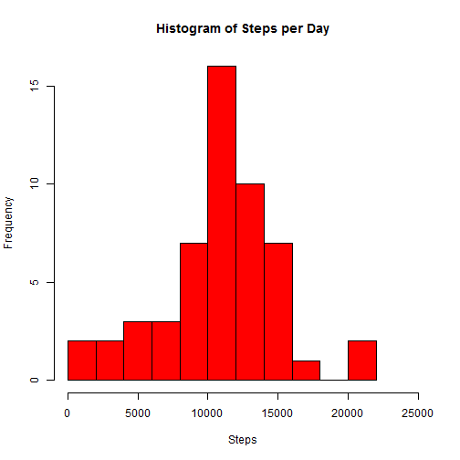
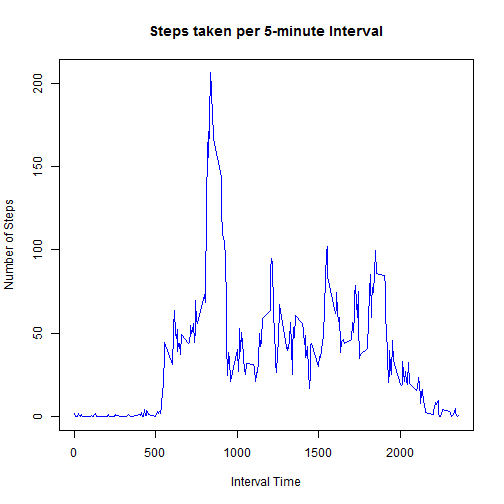
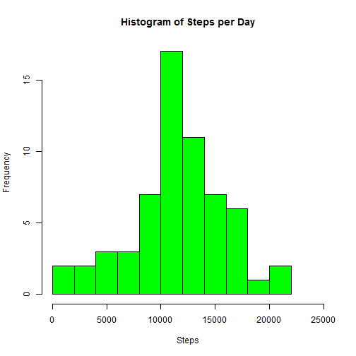
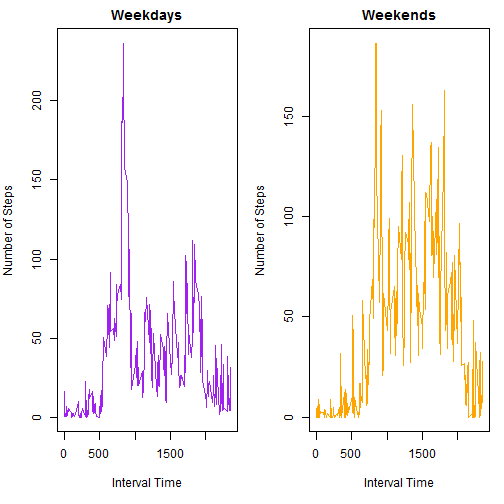

Reproducible Research: Peer Assessment 1
=========================================================

It is now possible to collect a large amount of data about personal movement using activity monitoring devices such as a Fitbit, Nike Fuelband, or Jawbone Up. These type of devices are part of the "quantified self" movement - a group of enthusiasts who take measurements about themselves regularly to improve their health, to find patterns in their behavior, or because they are tech geeks. But these data remain under-utilized both because the raw data are hard to obtain and there is a lack of statistical methods and software for processing and interpreting the data.

This assignment makes use of data from a personal activity monitoring device. This device collects data at 5 minute intervals through out the day. The data consists of two months of data from an anonymous individual collected during the months of October and November, 2012 and include the number of steps taken in 5 minute intervals each day.

## Loading and preprocessing the data
We will set the working directory to the RepData_PeerAssessment1 directory, and then read in the data.


```r
setwd("E:/Dropbox/JHU/repo/RepData_PeerAssessment1")
actdata <- read.csv("activity/activity.csv")
```

## What is mean total number of steps taken per day?
Calculate the total number of steps taken per day:

```r
newdata <- tapply(actdata$steps, actdata$date, sum)
```

Make a histogram of the total number of steps taken per day:

```r
newdata <- as.data.frame(newdata)
names(newdata) <- c("steps")
hist(newdata$steps, col = "red", breaks=12, xlim = c(0, 25000), xlab = "Steps", main = "Histogram of Steps per Day")
```



Calculate and report the mean and median of the total number of steps taken per day:

```r
summary(newdata$steps)
```

```
##    Min. 1st Qu.  Median    Mean 3rd Qu.    Max.    NA's 
##      41    8841   10760   10770   13290   21190       8
```

## What is the average daily activity pattern?
Make a time series plot of the 5-minute interval and the average number of steps taken, averaged
across all days:

```r
plot(as.character(unique(actdata$interval)), tapply(actdata$steps, actdata$interval, mean, na.rm = TRUE), type="l", main = "Steps taken per 5-minute Interval", xlab = "Interval Time", ylab = "Number of Steps", col = "blue")
```



Which 5-minute interval, on average, contains the maximum number of steps?

```r
maxdata <- tapply(actdata$steps, actdata$interval, mean, na.rm = TRUE)
maxdata[which.max(as.matrix(maxdata))]
```

```
##      835 
## 206.1698
```
The time period with the maximum number of steps is the 835 (8:35 am) time period, with 206.1698 steps average.

## Imputing missing values
Calculate and report the total number of missing values in the dataset:

```r
sum(is.na(actdata$steps))
```

```
## [1] 2304
```

Devise a strategy for filling in all of the missing values in the dataset:
I have decided to use the mice package (Multivariate Imputation by Chained Equations) to impute
the missing values in the dataset. This impuation uses predictive mean matching to fill in the
missing values.

Create a new dataset that is equal to the original dataset, but with the missing data filled in:

```r
library(mice)
tempdata <- mice(actdata, m=1, maxit=25, seed=1024)
```


```r
completedData <- complete(tempdata, 1)
```

Make a histogram of the total number of steps taken each day, and calculate and report the mean and
median total number of steps taken per day:

```r
newCompletedData <- tapply(completedData$steps, completedData$date, sum)
newCompletedData <- as.data.frame(newCompletedData)
names(newCompletedData) <- c("steps")
hist(newCompletedData$steps, col = "green", breaks=12, xlim = c(0, 25000), xlab = "Steps", main = "Histogram of Steps per Day")
```



```r
summary(newCompletedData$steps)
```

```
##    Min. 1st Qu.  Median    Mean 3rd Qu.    Max. 
##      41    9819   11350   11450   14340   21190
```


Do these values differ from the estimates from the first part of the assignment?
Yes, the dataset with the imputed values has a higher overall mean and median steps per day,
although the increase is not significant.

What is the impact of imputing missing data on the estimates of the total daily number of steps?
The impact is not significant, most likely because 'mice' used data that were statistically similar
to fill in the missing values.


## Are there differences in activity patterns between weekdays and weekends?

Create a new factor variable in the dataset with two levels - "weekday" and "weekend" indicating whether a given date is a weekday or weekend day.

```r
completedData$date <- as.Date(completedData$date)
completedData$wdwe <- weekdays(completedData$date)
completedData$wdwe <- gsub("Monday", "weekday", completedData$wdwe)
completedData$wdwe <- gsub("Tuesday", "weekday", completedData$wdwe)
completedData$wdwe <- gsub("Wednesday", "weekday", completedData$wdwe)
completedData$wdwe <- gsub("Thursday", "weekday", completedData$wdwe)
completedData$wdwe <- gsub("Friday", "weekday", completedData$wdwe)
completedData$wdwe <- gsub("Saturday", "weekend", completedData$wdwe)
completedData$wdwe <- gsub("Sunday", "weekend", completedData$wdwe)
completedData$wdwe <- as.factor(completedData$wdwe)
```

Make a panel plot containing a time series plot of the 5-minute interval and the average number of steps taken, averaged across all weekday days or weekend days:

```r
splitdf <- split(completedData, completedData$wdwe)
par(mfrow = c(1,2), mar = c(5,4,2,1))
plot(as.character(unique(splitdf[[1]]$interval)), tapply(splitdf[[1]]$steps, splitdf[[1]]$interval, mean), type="l", main = "Weekdays", xlab = "Interval Time", ylab = "Number of Steps", col = "purple")
plot(as.character(unique(splitdf[[2]]$interval)), tapply(splitdf[[2]]$steps, splitdf[[2]]$interval, mean), type="l", main = "Weekends", xlab = "Interval Time", ylab = "Number of Steps", col = "orange")
```


